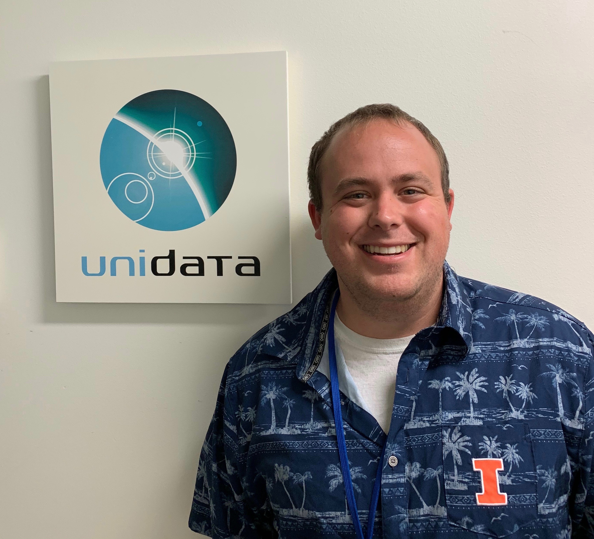

# Internship and Work Experience
**[Unidata Software Development Intern (May 2019 - August 2019)](unidata_work.md)**  
*University Corporation for Atmospheric Research (UCAR) | Boulder, Colorado*  
- Actively developed [MetPy](https://github.com/Unidata/MetPy), a Python library for Meteorology  
- Instructed faculty, students, and other professionals at the
[Unidata Workshop in Albany, New York](https://unidata.github.io/python-workshop/events/albany2019.html)  

**[Independent Student Contractor (August 2018 - August 2019)](microclimate.md)**  
*United States Geological Survey (USGS) | Chesterton, Indiana*
- Created data workflow in Python for Indiana Dunes microclimate sensors
- Finalized project through both a poster and virtual training sessions

# Research Projects
**[Raspberry SCI: Inexpensive Parallel Computing for Meteorology](rasberry_sci.md)**  
*Funded by Valparaiso University Guild | Valparaiso, Indiana*
- Worked with Dr. Nicholas Rosasco, Dr. Kevin Goebbert, and Terry Wade at Valpo
- Coordinated with Eliott Foust from the National Center for Atmospheric Research (NCAR)
- Finalized clusters are being implemented into the Numerical Weather Prediction class

**[Tornado Damage Path Detection Using Hyper-Spectral Imagery](uni_reu.md)**  
*Research Experience for Undergraduates | University of Northern Iowa | Cedar Falls, Iowa*
- Interdisciplinary program focused on hyper-spectral imagery research applications
- Participated in professional development workshops and visited USGS EROS station
- Presented at the AMS Annual Meeting in Phoenix, Arizona  

# Education
**University of Illinois Urbana-Champaign (Anticipated 2021)**  
*Master of Science in Atmospheric Science*
- Funded through [Relampago Field Campaign](https://sites.google.com/illinois.edu/relampago/home)  
- Advised by [Dr. Robert Jeffrey Trapp](https://www.atmos.illinois.edu/cms/One.aspx?portalId=127458&pageId=151980)    

**Valparaiso University (2019)**  
*Bachelor of Science - Meterology Major - Mathematics Minor*
- Dean's List  
- Presidential Scholarship Based on Merit  
- Valpo Alumni Award    

## Important Links
[LinkedIn](https://www.linkedin.com/in/mgroverwx/)  
[Twitter](https://twitter.com/mgroverwx)  
[Facebook](https://www.facebook.com/maxi2312)
